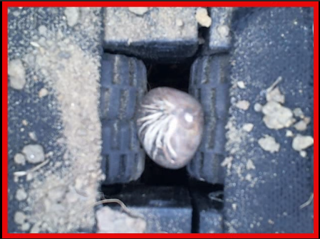

# Malabar Chestnut Classification
 

This project is detect the orientation of a malabar seed. Classify the orientation into up, down, side based on the location of the hilum. See full demo video [here](https://www.youtube.com/watch?v=wa0uvWAV5Xc).

## Usage

#### File

**arduino_demo.py**
Demo with arduino and the whole mechanism . 
Computer: run arduino_demo.py 
Arduino: run ./../arduino/motor_control/motor_control.ino 

**real_time_demo.py**
Demo with webcam (laptop's webcam) 

**test.py**
test accuracy of Vgg19 with testing data. 

#### Folder
**demo_video**
Contain two videos. Each video records a real-time bud detecting process.

**net**
Contain a python module named vgg19. Also, vgg19.py demos how to predict the label of an image

**weights**
Contains three different weights of VGG19 Net. 
  1. **fine_tune_weight.npy**
    Always load it when predicting labels
  2. **unfine_tune_weight.npy**
    Not important.
  3. **vgg19.npy**
Pretrained weights which is pretrained on ILSVRC. Now important either.

**data**
Contain training data and testing data. Literaly bunch of images. 

**train**
Contain requiring tools to train VGG19 Net. 
**Don't execute** it unless one knows how to train VGG19 Net. 

